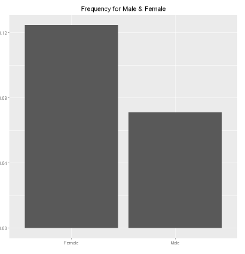
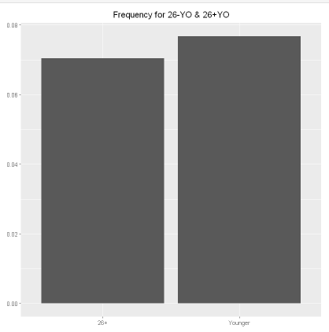
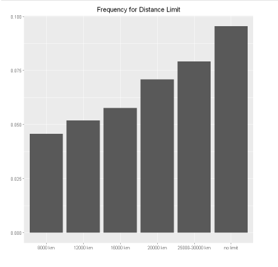
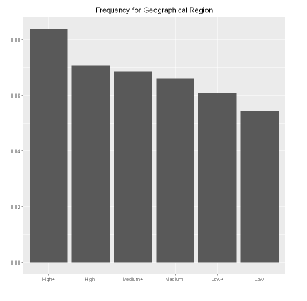
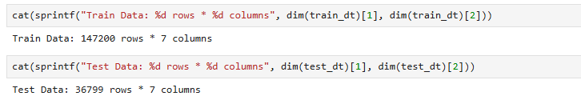
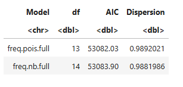
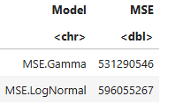

# Insurance Pricing using Generalized Linear Models (GLMs)
## Motor Insurance Pricing using the Norauto Dataset

## Overview

This project demonstrates an end-to-end actuarial pricing workflow using the norauto motor insurance dataset from the CASdatasets package.

The objective is to estimate the expected claim cost for each policyholder by modelling:

- Frequency
- Severity
- Pure Premium
- Gross Premium

The project follows a traditional General Insurance pricing framework by comparing multiple statistical models, selecting the most appropriate models using objective performance measures, and interpreting results from an actuarial perspective.

## Business Problem
Motor insurers must determine premiums that adequately reflect each policyholder's expected future claims while covering operating expenses and generating a target level of profit.

This project demonstrates how Generalized Linear Models (GLMs) can be used to estimate expected claim costs and convert them into insurance premiums. Gross premiums are also considered by allowing variable expenses, and profit margin, etc.

### Pricing Framework
- Pure Premium

$$
Pure Premium = Frequency * Severity
$$
- Gross Premium

$$
Gross Premium = \frac{Pure Premim}{1 - Variable Expense Ratio - Profit Margin}
$$

## Dataset

The Norauto dataset, available through the CASdatasets R package([CASDatasets](https://dutangc.github.io/CASdatasets/index.html)), comprises 183,999 observations of automobile insurance policies losses over a one-year period.

| Variable | Description |
|----------|-------------|
| Male | 1 if the policyholder is a male, 0 otherwise |
| Young | 1 if the policyholder age is below 26 years, 0 otherwise |
| DistLimit | The distance limit as stated in the insurance contract: "8000 km", "12000 km", "16000 km", "20000 km", "25000-30000 km", "no limit". |
| GeoRegion | Density of the geographical region (from heaviest to lightest): "High+", "High-", "Medium+", "Medium-", "Low+", "Low-". |
| Expo | Exposure as a fraction of year. |
| NbClaim | claim number |
| ClaimAmount | 0 or the average claim amount if NbClaim > 0. |

## Feature Engineering & Explanatory Data Analysis: Male, Young, DistLimit, GeoRegion
### 1. Feature Engineering: Relevel Factor Variables
DistLimit and GeoRegion are factored with their levels listed below. However, given the information from data author, they will be re-leveled in the same mentioned above, which will make following plots more meaningful.

After relevelling, variable DistLimit are in order "8000 km", "12000 km", "16000 km", "20000 km", "25000-30000 km", "no limit". Varibale GeoRegion are in order of "High+", "High-", "Medium+", "Medium-", "Low+", "Low-", which is ordered from heaviest to lightest.

### 2. Data Summary
For the above four variables, grouping is performed on each to derive total number of policies in each category, frequency and severity in each category. 
Before outputting summarries, a function is created with column names as input for reducing repetitive workload.
Final outputs for the four variables are listed below.

### 3. Visuals of Frequency
Plots of frequency for each variable are as follows,

**Male**

**Young**

**DistLimit**

**GeoRegion**

## Train data & Test Data
Before frequency and severity modelling, relevelled data is split into train and test datasets, with 80% for train data, and 20% for test data.
Dimension for train and test datasets are,

## Frequency Modelling

### Poisson

### Negative Binomial

- Initial Theta for glm.nb in R

### Model Selection: AIC and Dispersion
AIC and Dispersion are calculated for either model, which shows that Poisson is a good fit to the train data, with lower AIC and Dispersion closer to 1. 

## Severity Modelling

### Gamma 

### Log Normal

### Model Selection: MSE
MSE, or Mean Squared Errors, is used to measure performance between models. MSE shows that Gamma model has lower MSE, which is an indicator of good-fit to test data.

## Pure Premium

